# Image Coloring Project

This project focuses on colorizing grayscale images of flowers using a WGAN (Wasserstein Generative Adversarial Network) with gradient penalty and Mean Squared Error (MSE) loss.

### Time Line:
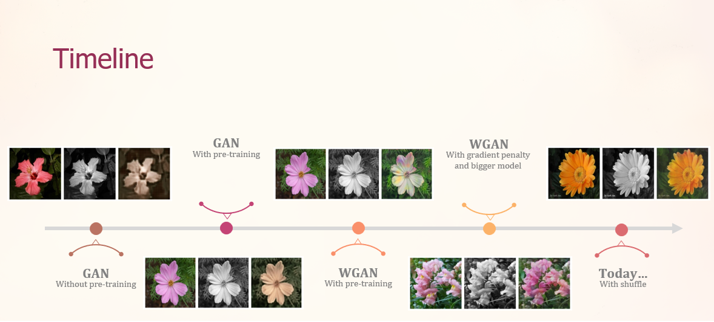

## Dataset

The dataset used in this project is the "102 Category Flower Dataset" by Maria-Elena Nilsback and Andrew Zisserman. It contains 8,189 images, which were split into 70% for training, 15% for validation, and 15% for testing. All images were normalized to a resolution of 256x256 pixels and converted from RGB to grayscale format.
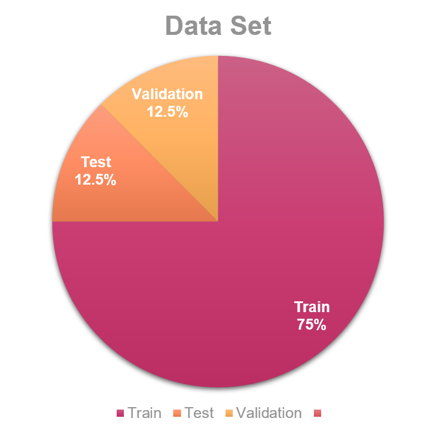
## Architecture

### Generator

The generator architecture follows a U-Net design, consisting of:

1. Three encoder blocks, each with a convolutional block (two convolution layers, batch normalization, and ReLU activation) and a MaxPooling layer.
2. A bottleneck layer formed by a convolutional block.
3. Three decoder blocks, each with an Upsampling layer and a convolutional block.
4. A final convolutional layer on the decoder block result.

### Critic

The critic architecture includes:

1. A convolutional layer followed by a leaky ReLU activation function.
2. Three blocks of convolutional layers with instance normalization and leaky ReLU activation.
3. A final convolutional layer.

### Optimizer

The Adam optimizer was used, as it is widely recommended for WGANs due to its effectiveness.

## Pre-Training

Initially, only the generator was pre-trained for 4 epochs with MSE loss to initialize the weights and improve convergence.

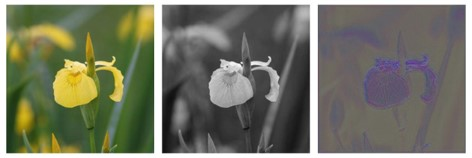
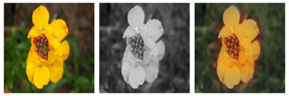

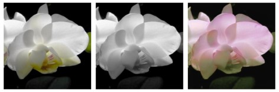

## Training

The model was trained for 95 epochs, with an alternating training scheme between the generator and the critic. The critic was trained once in 4 batches, followed by a single-batch training session for the generator. The generator was trained over the entire dataset.

- **Critic**: The WGAN loss was employed, calculated between the critic's evaluation on the generated images and the corresponding real RGB images. A gradient penalty was incorporated into the loss function to enhance training stability.

- **Generator**: Both the WGAN loss and the MSE loss were used, with emphasis on the MSE loss. The mean of the critic's evaluation on the generated RGB images was computed, and the MSE loss between the generated images and the real RGB images was added.

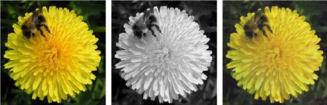
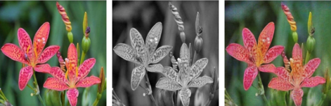
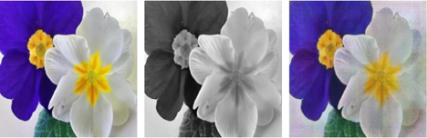

**Tain Graphs**:
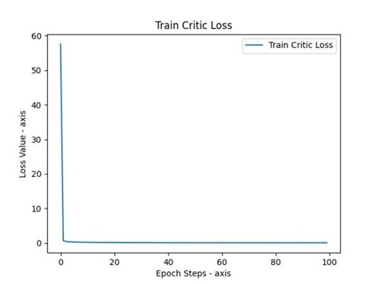
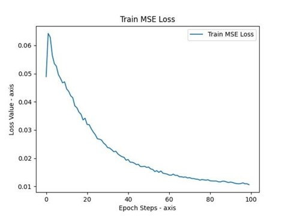
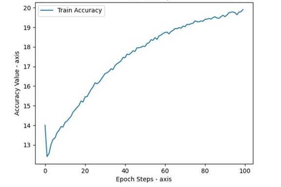

**Validation**:

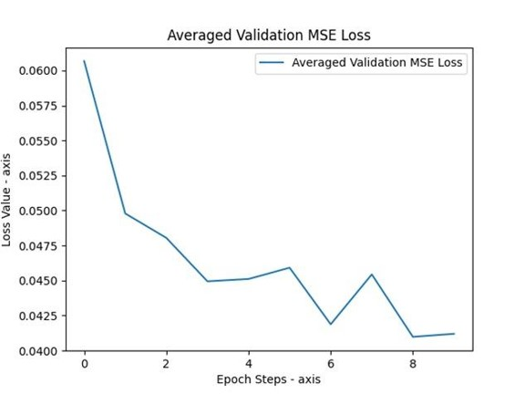

- **Test & Accuracy**: The Peak Signal-to-Noise Ratio (PSNR) was used to evaluate the performance and quality of the model by comparing the generated RGB images to the original RGB images. A higher PSNR value indicates better reconstruction quality.

**Test Graphs**:

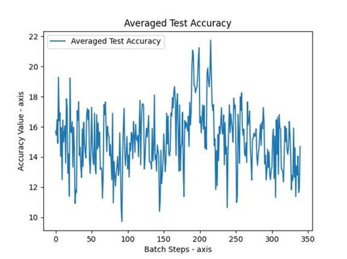

## Results
The project includes visualizations of the training and validation losses, accuracy (PSNR), and sample generated images.

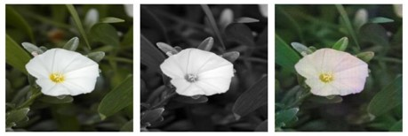
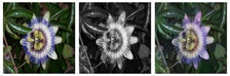

## How to Run

1. Clone the repository or download the project files.
2. Install the required dependencies (PyTorch, torchvision, etc.).
3. Run the `ImageColoringProject.ipynb` notebook to train the model and generate colorized images.

Note: The project includes pre-trained models and saved results, so you can explore the generated images without retraining the model.

